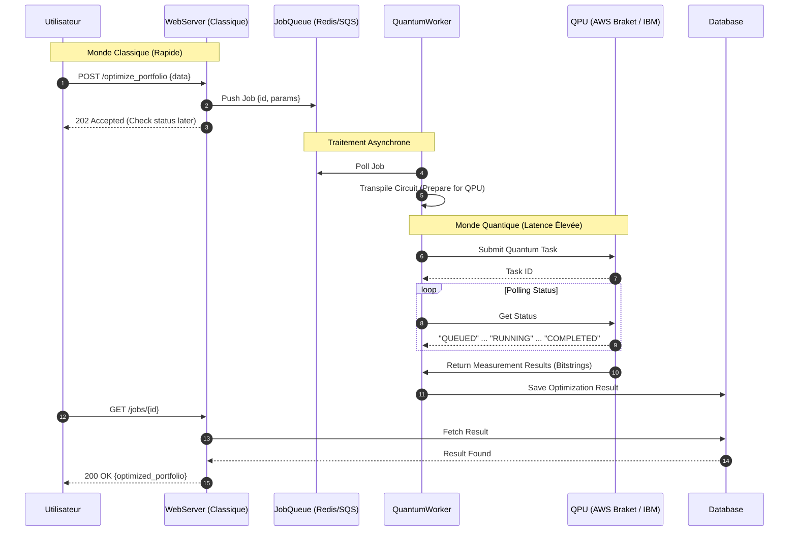

<!--
Auteur : Julien Bombled
Licence : Apache License 2.0
-->

# Architecture Hybride de Référence

Cette page détaille les interactions techniques entre le monde classique et le monde quantique. Le point clé à retenir est l'asynchronisme : on ne "parle" pas à un QPU en temps réel, on lui soumet des jobs via une file d'attente.

## 1. Le Flux de Données (Workflow Asynchrone)

Dans ce scénario, une application financière demande une optimisation de portefeuille. Le calcul quantique étant une ressource rare et lente (file d'attente mondiale), l'architecture doit être **Event-Driven**.



## 2. La "Zone Rouge" : Ségrégation et Sécurité

Pour les environnements sensibles (Banque, Défense, OIV), il est impératif de ne jamais exposer les données brutes au Cloud Public qui héberge le QPU.

L'architecture repose sur un **Proxy d'Obfuscation**. Ce composant transforme les données sensibles en paramètres mathématiques abstraits avant qu'elles ne quittent le réseau privé. Le QPU reçoit une équation à résoudre, sans connaître le contexte métier (noms des clients, montants réels).

```mermaid
graph TD
    subgraph "Zone de Confiance (Privé / SecNumCloud)"
        style "Zone de Confiance (Privé / SecNumCloud)" fill:#e1f5fe,stroke:#01579b
        App[Application Métier]
        SensData[(Données Sensibles)]
        App --> SensData
        
        Proxy[Obfuscation Proxy / Gateway]
        style Proxy fill:#ffcc80,stroke:#e65100,stroke-width:2px
        
        App -- "Données Brutes" --> Proxy
        Proxy -- "Anonymisation / Abstraction" --> Proxy
    end

    boundary[Firewall / DMZ]
    
    subgraph "Public Quantum Cloud"
        style "Public Quantum Cloud" fill:#f3e5f5,stroke:#4a148c
        API[Cloud API Endpoint]
        QPU_H[Quantum Hardware]
        
        API --> QPU_H
    end

    Proxy -- "Circuit Abstrait (QASM)" --> boundary
    boundary -- "HTTPS (TLS 1.3 + PQC)" --> API

    linkStyle 4 stroke:#f44336,stroke-width:2px,dasharray: 5 5;
```
